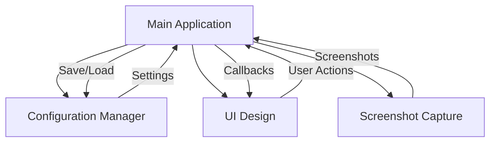
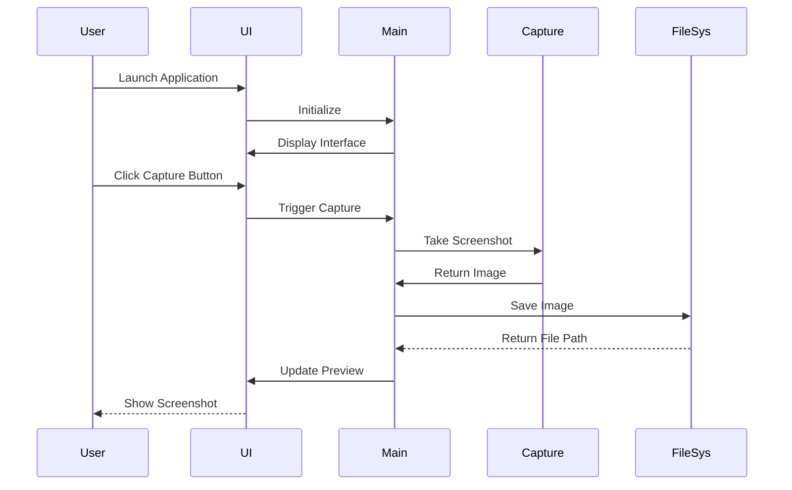

# pxsnap

A lightweight professional-grade screenshot utility for Windows that combines simplicity with powerful features. Designed for developers and power users who need a reliable tool for capturing screenshots with minimal overhead. 


## Features

- **Full Screen Capture**: Capture your entire screen with a single keystroke
- **Region Selection**: Select and capture specific areas of your screen
- **Automatic Saving**: Screenshots are automatically saved to your Pictures folder
- **Customizable Settings**: Configure save location, file format, naming, and more
- **Live Preview**: See your screenshots immediately after capture
- **Custom Hotkeys**: Override default Print Screen behavior with custom shortcuts
- **Responsive UI**: Clean, modern interface that adapts to different screen sizes
- **Timestamp Overlay**: Automatically add timestamps to your screenshots

## Installation

1. Clone the repository:
```bash
git clone https://github.com/BLShaw/pxsnap.git
cd pxsnap
```

2. Install the required dependencies:
```bash
pip install -r requirements.txt
```

3. Run the application:
```bash
python main.py
```

## Usage

### Quick Start

- **Full Screen Screenshot**: Press Print Screen or click the "Full Screen" button
- **Region Screenshot**: Press Ctrl+Print Screen or click "Select Region", then click and drag to select an area
- **Access Settings**: Use the Settings panel to customize save location, file format, and other options

### Configuration

pxsnap automatically saves your preferences in a configuration file. You can customize:

- **Save Directory**: Where screenshots are saved (default: Pictures folder)
- **File Prefix**: Custom prefix for screenshot filenames
- **File Format**: PNG or JPG
- **Hotkeys**: Customize keyboard shortcuts
- **Preview Options**: Show preview after capture
- **Auto-Open Folder**: Automatically open the save folder after capture

## Architecture



## User Flow



## Requirements

- Python 3.7+
- Windows operating system
- Required Python packages (see requirements.txt):
  - pyautogui
  - Pillow
  - keyboard

## Contributing

Contributions are welcome! Please feel free to submit a Pull Request.

1. Fork the project
2. Create your feature branch (`git checkout -b feature/NewFeature`) 
3. Commit your changes (`git commit -m 'Add some NewFeature'`) 
4. Push to the branch (`git push origin feature/NewFeature`) 
5. Open a Pull Request

## License

This project is licensed under the MIT License - see the [LICENSE](LICENSE) file for details.

## Acknowledgments

- Thanks to the developers of PyAutoGUI, Pillow, and Tkinter for providing the excellent libraries that power this application.
- Inspired by the need for a simple yet powerful screenshot tool for developers.